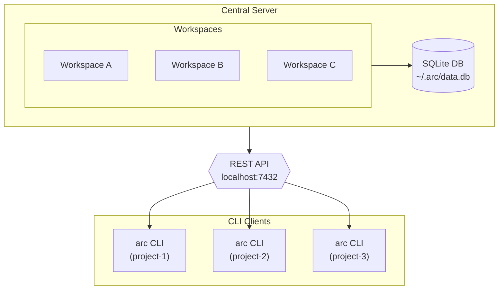

# Arc AI Issue Tracker

A central issue tracking server for AI-assisted coding workflows
This is heavily inspired by the amazing work over at [beads](https://github.com/steveyegge/beads)

Key Differences:

- no per-repo daemons
- no git sync or integration
- uses a REST API + CLI.
- embeded svelte web ui

## Features

- **Central Server**: Single server managing multiple workspaces
- **Web UI**: Svelete client app embedded in go server
- **REST API**: Clean JSON API for all operations
- **Workspaces**: First-class workspace management (replaces per-repo concept)
- **Full Issue Tracking**: Create, update, close, dependencies, labels, comments
- **Ready Work**: Find issues with no blockers
- **Statistics**: Aggregate metrics per workspace

## Installation

### Quick Install (Recommended)

```bash
curl -fsSL https://raw.githubusercontent.com/sentiolabs/arc/main/scripts/install.sh | bash
```

### Linux Packages

Download `.deb`, `.rpm`, or `.pkg.tar.zst` (Arch) from the [latest release](https://github.com/sentiolabs/arc/releases/latest).

```bash
# Debian/Ubuntu
sudo dpkg -i arc_*_linux_amd64.deb

# Fedora/RHEL
sudo rpm -i arc_*_linux_amd64.rpm

# Arch Linux
sudo pacman -U arc_*_linux_amd64.pkg.tar.zst
```

### From Source

```bash
git clone https://github.com/sentiolabs/arc
cd arc
make build
# Binary at ./bin/arc
```

## Quick Start

### Start the Server

```bash
# Start the daemon (background)
arc server start

# Or run in foreground
arc server run

# Custom options
arc server run --addr :8080 --db /path/to/data.db
```

The server stores data in `~/.arc/data.db` by default.

### CLI Usage

```bash

# Create a workspace
arc workspace create my-project --path /path/to/project

# Set default workspace
arc workspace use my-project

# Create issues
arc create "Implement feature X" -p 1 -t feature
arc create "Fix bug Y" -p 0 -t bug

# List issues
arc list
arc list --status open
arc list --type bug

# Show issue details
arc show mp-abc123

# Update issues
arc update mp-abc123 --status in_progress
arc update mp-abc123 --assignee alice

# Close issues
arc close mp-abc123 --reason "Fixed in commit abc"

# Find ready work
arc ready

# Show blocked issues
arc blocked

# Add dependencies
arc dep add mp-def456 mp-abc123  # def456 depends on abc123

# View statistics
arc stats
```

### Claude Code Integration

For AI-assisted workflows, arc provides a Claude Code plugin with hooks, skills, and agents.

**Option A: Install Plugin (Recommended)**

```bash
# In Claude Code, first add the marketplace
/plugin marketplace add sentiolabs/arc

# Then install the plugin
/plugin install arc

# Restart Claude Code
```

**Option B: CLI Hooks Only**

```bash
arc setup claude            # Global installation
arc setup claude --project  # Project-only installation
arc setup claude --check    # Verify installation
```

**What the Plugin Provides:**

| Component         | Benefit                                |
| ----------------- | -------------------------------------- |
| SessionStart Hook | Auto-runs `arc prime` on session start |
| PreCompact Hook   | Preserves context before compaction    |
| Prompt Config     | Reminds Claude to run `arc onboard`    |
| Skills            | Detailed guides for arc workflows      |
| Agent             | Bulk operations via Task tool          |

**Typical Setup:**

```bash
# 1. Start the server (if not running)
arc server start

# 2. Initialize workspace in your project
cd your-project
arc init

# 3. Install Claude integration (choose one)
/plugin marketplace add sentiolabs/arc && /plugin install arc  # Full plugin
# OR
arc setup claude                                                # Hooks only
```

### API Examples

```bash
# Health check
curl http://localhost:7432/health

# Create workspace
curl -X POST http://localhost:7432/api/v1/workspaces \
  -H "Content-Type: application/json" \
  -d '{"name": "my-project", "prefix": "mp"}'

# List issues
curl http://localhost:7432/api/v1/workspaces/ws-abc123/issues

# Create issue
curl -X POST http://localhost:7432/api/v1/workspaces/ws-abc123/issues \
  -H "Content-Type: application/json" \
  -d '{"title": "New feature", "priority": 1, "issue_type": "feature"}'

# Get ready work
curl http://localhost:7432/api/v1/workspaces/ws-abc123/ready
```

## Architecture



## Data Model

### Workspace

- ID (e.g., "ws-a1b2")
- Name, description, path
- Prefix for issue IDs

### Issue

- ID (e.g., "mp-abc123")
- Title, description
- Status: open, in_progress, blocked, deferred, closed
- Priority: 0 (critical) - 4 (backlog)
- Type: bug, feature, task, epic, chore
- Assignee, external reference

### Dependency Types

- `blocks`: Issue A blocks issue B
- `parent-child`: Hierarchical relationship
- `related`: Loose association
- `discovered-from`: Discovered during work on another issue

## Configuration

CLI configuration is stored in `~/.arc/cli-config.json`:

```json
{
  "server_url": "http://localhost:7432",
  "default_workspace": "ws-abc123"
}
```

## Development

```bash
# Build everything (frontend + binaries)
make build

# Build binaries only (faster)
make build-quick

# Run tests
make test

# Generate code (sqlc, OpenAPI, TypeScript)
make gen

# Docker
make docker-build
make docker-up
```

## API Reference

### Workspaces

- `GET /api/v1/workspaces` - List workspaces
- `POST /api/v1/workspaces` - Create workspace
- `GET /api/v1/workspaces/:id` - Get workspace
- `PUT /api/v1/workspaces/:id` - Update workspace
- `DELETE /api/v1/workspaces/:id` - Delete workspace
- `GET /api/v1/workspaces/:id/stats` - Get statistics

### Issues

- `GET /api/v1/workspaces/:ws/issues` - List issues
- `POST /api/v1/workspaces/:ws/issues` - Create issue
- `GET /api/v1/workspaces/:ws/issues/:id` - Get issue
- `PUT /api/v1/workspaces/:ws/issues/:id` - Update issue
- `DELETE /api/v1/workspaces/:ws/issues/:id` - Delete issue
- `POST /api/v1/workspaces/:ws/issues/:id/close` - Close issue
- `POST /api/v1/workspaces/:ws/issues/:id/reopen` - Reopen issue

### Ready Work & Blocked

- `GET /api/v1/workspaces/:ws/ready` - Ready issues
- `GET /api/v1/workspaces/:ws/blocked` - Blocked issues

### Dependencies

- `GET /api/v1/workspaces/:ws/issues/:id/deps` - Get dependencies
- `POST /api/v1/workspaces/:ws/issues/:id/deps` - Add dependency
- `DELETE /api/v1/workspaces/:ws/issues/:id/deps/:dep` - Remove dependency

### Labels

- `GET /api/v1/workspaces/:ws/labels` - List labels
- `POST /api/v1/workspaces/:ws/labels` - Create label
- `PUT /api/v1/workspaces/:ws/labels/:name` - Update label
- `DELETE /api/v1/workspaces/:ws/labels/:name` - Delete label
- `POST /api/v1/workspaces/:ws/issues/:id/labels` - Add label to issue
- `DELETE /api/v1/workspaces/:ws/issues/:id/labels/:label` - Remove label

### Comments

- `GET /api/v1/workspaces/:ws/issues/:id/comments` - Get comments
- `POST /api/v1/workspaces/:ws/issues/:id/comments` - Add comment
- `PUT /api/v1/workspaces/:ws/issues/:id/comments/:cid` - Update comment
- `DELETE /api/v1/workspaces/:ws/issues/:id/comments/:cid` - Delete comment

### Events

- `GET /api/v1/workspaces/:ws/issues/:id/events` - Get audit events

## License

MIT
