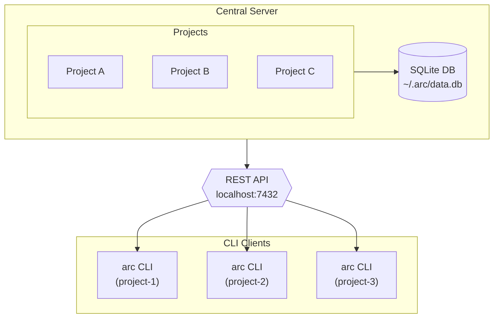

Arc AI Issue Tracker

Acentral issue tracking server for AI-assisted coding workflows
This is heavily inspired by the amazing work over at [beads](https://github.com/steveyegge/beads)

Key Differences:

- no per-repo daemons
- no git sync or integration
- uses a REST API + CLI.
- embeded svelte web ui

## Features

<<<<<<< Updated upstream
- **Central Server**: Single server managing multiple projects
- **Web UI**: Svelte client app embedded in Go server
=======
8vc2VhcmNoLXNuYXBzaG90LXRyYW5zbGF0aW9uLXBpcGVsaW5lLXpoLXByb2Qvb3V0cHV0LyA=- **Central Server**: Single server managing multiple workspaces

- **Web UI**: Svelete client app embedded in go server
>>>>>>> Stashed changes
- **REST API**: Clean JSON API for all operations
- **Projects**: First-class project management (replaces per-repo concept)
- **Full Issue Tracking**: Create, update, close, dependencies, labels, comments
- **Plans**: Inline plans on issues, shared plans linkable to multiple issues
- **Ready Work**: Find issues with no blockers
- **Agent Teams**: Coordinate multi-agent workflows with `teammate:*` labels and team context
- **Statistics**: Aggregate metrics per project

## Installation

### Quick Install (Recommended)

```bash
curl -fsSL https://raw.githubusercontent.com/sentiolabs/arc/main/scripts/install.sh | bash
```

### Linux Packages

Download `.deb`, `.rpm`, or `.pkg.tar.zst` (Arch) from the [latest release](https://github.com/sentiolabs/arc/releases/latest).

```bash
# Debian/Ubuntu
sudo dpkg -i arc_*_linux_amd64.deb

# Fedora/RHEL
sudo rpm -i arc_*_linux_amd64.rpm

# Arch Linux
sudo pacman -U arc_*_linux_amd64.pkg.tar.zst
```

### From Source

```bash
git clone https://github.com/sentiolabs/arc
cd arc
make build
# Binary at ./bin/arc
```

## Quick Start

### Start the Server

```bash
# Start the daemon (background)
arc server start

# Or run in foreground
arc server start --foreground

# Custom options
arc server start --foreground --port 8080 --db /path/to/data.db
```

The server stores data in `~/.arc/data.db` by default.

### CLI Usage

#### Getting Started

```bash
# Initialize arc in your project directory (creates project + config)
cd your-project
arc init                        # Uses directory name as project
arc init my-project             # Custom project name
arc init --prefix mp            # Custom issue prefix (e.g., mp-a3f2)

# Check which project is active
arc which
```

#### Day-to-Day Workflow

```bash
# Find available work
arc ready                       # Issues with no blockers
arc blocked                     # Issues waiting on dependencies

# Create issues
arc create "Implement feature X" -p 1 -t feature
arc create "Fix bug Y" -p 0 -t bug

# View and update issues
arc show mp-abc123
arc list                        # All issues
arc list --status open --type bug
arc list --parent mp-abc123     # List children of an epic
arc update mp-abc123 --status in_progress
arc update mp-abc123 --assignee alice

# Close issues
arc close mp-abc123 --reason "Fixed in commit abc"

# View statistics
arc stats
```

#### Dependencies

```bash
# Add a blocker: def456 depends on abc123
arc dep add mp-def456 mp-abc123

# Other dependency types
arc dep add child parent --type parent-child
arc dep add issue-a issue-b --type related
arc dep add side-quest origin --type discovered-from
```

#### Epic & Subtask Patterns

```bash
# Create an epic with child issues
arc create "Auth overhaul" -t epic
arc create "JWT tokens" -t task --parent mp-abc123
arc create "OAuth provider" -t task --parent mp-abc123
```

#### Agent Teams

```bash
# Label tasks for team members
arc label add mp-def456 teammate:backend
arc label add mp-ghi789 teammate:frontend

# View team context (issues grouped by role)
arc team context mp-abc123      # For a specific epic
arc team context                # All teammate-labeled issues

# Prime context for a specific role
arc prime --role backend        # Filtered context for backend agent
```

#### Plans

```bash
# Register a plan for review (from a markdown file)
arc plan create --file docs/plans/2026-03-14-auth-system.md

# View plan content, status, and comments
arc plan show <plan-id>

# Review workflow
arc plan approve <plan-id>
arc plan reject <plan-id>
arc plan comments <plan-id>
```

#### Documentation & Help

```bash
arc docs                        # Overview of all topics
arc docs search "dependencies"  # Fuzzy search across all docs
arc docs plans                  # Full topic on plans
arc quickstart                  # Quick start guide
arc self update                 # Update to latest version
```

#### Advanced: Project Management

```bash
# For multi-project setups or manual project control
arc project create my-project
arc project use my-project      # Set default project
arc project list
arc project delete ws-abc123
```

### Claude Code Integration

For AI-assisted workflows, arc provides a Claude Code plugin with hooks, skills, and agents.

**Option A: Install Plugin (Recommended)**

```bash
# In Claude Code, first add the marketplace
/plugin marketplace add sentiolabs/arc

# Then install the plugin
/plugin install arc

# Restart Claude Code
```

**Option B: CLI Hooks Only**

```bash
arc setup claude            # Global installation
arc setup claude --project  # Project-only installation
arc setup claude --check    # Verify installation
```

**What the Plugin Provides:**

| Component         | Benefit                                |
| ----------------- | -------------------------------------- |
| SessionStart Hook | Auto-runs `arc prime` on session start |
| PreCompact Hook   | Preserves context before compaction    |
| Prompt Config     | Reminds Claude to run `arc onboard`    |
| Skills (9)        | Guided workflows (see below)           |
| Agents (2)        | Issue tracker + code reviewer          |

**Planning Workflow (Skills):**

The plugin includes 9 skills that guide Claude through a structured development lifecycle:

```
brainstorm → plan → implement → review → finish
                        ↓           ↓
                      debug       verify
```

| Skill       | Purpose                                                       |
| ----------- | ------------------------------------------------------------- |
| `brainstorm`| Socratic design discovery — explores requirements, proposes approaches, saves design to arc |
| `plan`      | Breaks approved designs into self-contained implementation tasks with exact file paths |
| `implement` | Dispatches `arc-implementer` subagents per task (TDD: red → green → refactor) |
| `review`    | Dispatches `arc-reviewer` subagent to review code changes against task spec |
| `debug`     | Root cause analysis when tests fail or implementations get stuck |
| `verify`    | Fresh verification before claiming work is complete |
| `finish`    | Session completion — updates arc issues, commits, pushes |
| `arc`       | General arc CLI reference and workflow context |
| `arc-team-deploy` | Multi-agent team deployment with `teammate:*` label routing |

**Typical Setup:**

```bash
# 1. Start the server (if not running)
arc server start

# 2. Initialize project in your directory
cd your-project
arc init

# 3. Install Claude integration (choose one)
/plugin marketplace add sentiolabs/arc && /plugin install arc  # Full plugin
# OR
arc setup claude                                                # Hooks only
```

### Codex CLI Integration

Codex CLI supports repo-scoped skills under `.codex/skills`. Arc provides a Codex skill bundle
and a setup command to install it into your repo.

```bash
# 1. Start the server (if not running)
arc server start

# 2. Initialize project in your directory
cd your-project
arc init

# 3. Install Codex integration (repo-scoped skill)
arc setup codex
```

**Notes:**

- Codex CLI does not support lifecycle hooks. Run `arc onboard` at session start.
- Use `arc prime` after compaction or if workflow context is stale.

### API Examples

```bash
# Health check
curl http://localhost:7432/health

# Create project
curl -X POST http://localhost:7432/api/v1/projects \
  -H "Content-Type: application/json" \
  -d '{"name": "my-project", "prefix": "mp"}'

# List issues
curl http://localhost:7432/api/v1/projects/ws-abc123/issues

# Create issue
curl -X POST http://localhost:7432/api/v1/projects/ws-abc123/issues \
  -H "Content-Type: application/json" \
  -d '{"title": "New feature", "priority": 1, "issue_type": "feature"}'

# Get ready work
curl http://localhost:7432/api/v1/projects/ws-abc123/ready
```

## Architecture


```mermaid
flowchart TB
    subgraph server["Central Server"]
        subgraph projects["Projects"]
            ws1["Project A"]
            ws2["Project B"]
            ws3["Project C"]
        end
        db[("SQLite DB<br/>~/.arc/data.db")]
        projects --> db
    end

    api{{"REST API<br/>localhost:7432"}}
    server --> api

    subgraph clients["CLI Clients"]
        cli1["arc CLI<br/>(project-1)"]
        cli2["arc CLI<br/>(project-2)"]
        cli3["arc CLI<br/>(project-3)"]
    end

    api --> cli1
    api --> cli2
    api --> cli3
```

## Data Model

### Project

- ID (e.g., "ws-a1b2")
- Name, description
- Prefix for issue IDs

### Issue

- ID (e.g., "mp-abc123")
- Title, description
- Status: open, in_progress, blocked, deferred, closed
- Priority: 0 (critical) - 4 (backlog)
- Type: bug, feature, task, epic, chore
- Assignee, external reference

### Dependency Types

- `blocks`: Issue A blocks issue B (affects ready work)
- `parent-child`: Hierarchical relationship (affects ready work)
- `related`: Loose association
- `discovered-from`: Discovered during work on another issue

### Label

- Name, color, description
- Global scope (shared across projects)

### Comment

- Text with author
- Type: `comment` (regular) or `plan` (inline plan)

### Event

- Audit trail entries (status changes, field updates, etc.)

### Plan (Shared)

- ID (e.g., "plan.xxxxx"), title, content
- Scoped to project, linkable to multiple issues

## Configuration

Arc uses three configuration layers (highest priority wins):

1. **CLI config** (`~/.arc/cli-config.json`) — server URL, default project
2. **Project config** (`~/.arc/projects/<path>/config.json`) — per-directory project binding

```json
{
  "server_url": "http://localhost:7432",
  "default_project": "ws-abc123"
}
```

Resolution priority: CLI flag > project config > CLI config defaults.

## Development

```bash
# Build everything (frontend + binaries)
make build

# Build binaries only (faster)
make build-quick

# Run tests
make test

# Generate code (sqlc, OpenAPI, TypeScript)
make gen

# Docker
make docker-build
make docker-up
```

## API Reference

### Projects

- `GET /api/v1/projects` - List projects
- `POST /api/v1/projects` - Create project
- `GET /api/v1/projects/:id` - Get project
- `PUT /api/v1/projects/:id` - Update project
- `DELETE /api/v1/projects/:id` - Delete project
- `GET /api/v1/projects/:id/stats` - Get statistics

### Workspaces (Directory Paths)

- `GET /api/v1/projects/:id/workspaces` - List workspace paths
- `POST /api/v1/projects/:id/workspaces` - Add workspace path
- `DELETE /api/v1/projects/:id/workspaces/:wid` - Remove workspace path

### Issues

- `GET /api/v1/projects/:id/issues` - List issues
- `POST /api/v1/projects/:id/issues` - Create issue
- `GET /api/v1/projects/:id/issues/:iid` - Get issue
- `PUT /api/v1/projects/:id/issues/:iid` - Update issue
- `DELETE /api/v1/projects/:id/issues/:iid` - Delete issue
- `POST /api/v1/projects/:id/issues/:iid/close` - Close issue
- `POST /api/v1/projects/:id/issues/:iid/reopen` - Reopen issue

### Ready Work & Blocked

- `GET /api/v1/projects/:id/ready` - Ready issues
- `GET /api/v1/projects/:id/blocked` - Blocked issues

### Team Context

- `GET /api/v1/projects/:id/team-context` - Issues grouped by `teammate:*` labels
- `GET /api/v1/projects/:id/team-context?epic_id=ID` - Scoped to epic children

### Dependencies

- `GET /api/v1/projects/:id/issues/:iid/deps` - Get dependencies
- `POST /api/v1/projects/:id/issues/:iid/deps` - Add dependency
- `DELETE /api/v1/projects/:id/issues/:iid/deps/:dep` - Remove dependency

### Labels (Global)

- `GET /api/v1/labels` - List labels
- `POST /api/v1/labels` - Create label
- `PUT /api/v1/labels/:name` - Update label
- `DELETE /api/v1/labels/:name` - Delete label

### Issue Labels

- `POST /api/v1/projects/:id/issues/:iid/labels` - Add label to issue
- `DELETE /api/v1/projects/:id/issues/:iid/labels/:label` - Remove label

### Comments

- `GET /api/v1/projects/:id/issues/:iid/comments` - Get comments
- `POST /api/v1/projects/:id/issues/:iid/comments` - Add comment
- `PUT /api/v1/projects/:id/issues/:iid/comments/:cid` - Update comment
- `DELETE /api/v1/projects/:id/issues/:iid/comments/:cid` - Delete comment

### Inline Plans

- `POST /api/v1/projects/:id/issues/:iid/plan` - Set inline plan
- `GET /api/v1/projects/:id/issues/:iid/plan` - Get inline plan
- `GET /api/v1/projects/:id/issues/:iid/plan/history` - Get plan history

### Shared Plans

- `GET /api/v1/projects/:id/plans` - List shared plans
- `POST /api/v1/projects/:id/plans` - Create shared plan
- `GET /api/v1/projects/:id/plans/:pid` - Get shared plan
- `PUT /api/v1/projects/:id/plans/:pid` - Update shared plan
- `DELETE /api/v1/projects/:id/plans/:pid` - Delete shared plan
- `POST /api/v1/projects/:id/plans/:pid/link` - Link issues to plan
- `DELETE /api/v1/projects/:id/plans/:pid/link/:iid` - Unlink issue from plan

### Events

- `GET /api/v1/projects/:id/issues/:iid/events` - Get audit events

## License

MIT
